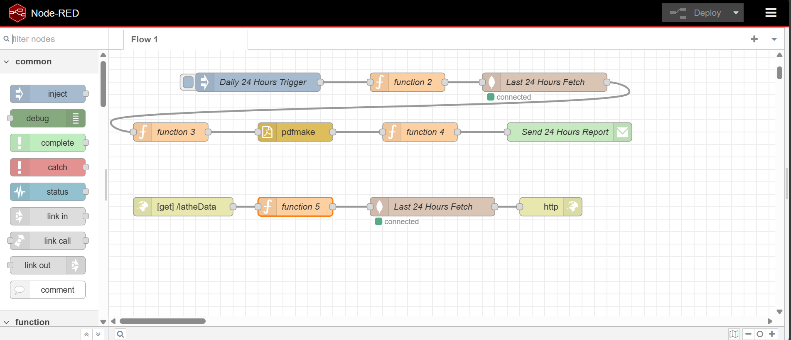
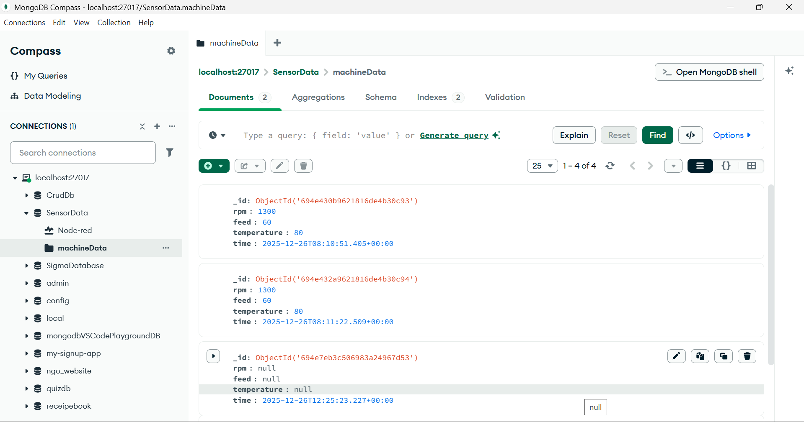

# 🛠️ Lathe Machine Monitoring using Node-RED, MongoDB, Email PDF & Grafana

This project monitors **Lathe Machine Parameters** like **RPM, Feed & Temperature** using Node-RED, stores data into MongoDB, automatically deletes records older than 5 days, sends **Auto PDF Report every 24 Hours via Email**, and visualizes live machine data in **Grafana Dashboard**.

---

## 📌 Project Architecture
- Node-RED generates sensor data (or accepts real sensors)
- Stores data in **MongoDB**
- Deletes records older than 5 days Automatically
- Fetches last 24 hours data → Converts to PDF
- Sends PDF on Email using Gmail SMTP
- Provides API → `/latheData`
- Grafana uses API to display live charts

Node-RED → MongoDB → Auto Clean Data  
Node-RED → PDF → Gmail Auto Report  
Node-RED → API → Grafana Visualization  

---

## 🖼️ Project Screenshots

### ✅ Grafana Dashboard

---

### ✅ Node-RED Flow

---

### ✅ MongoDB Data

---

## 🚀 Features
✔ Store Machine Data in MongoDB  
✔ Auto Delete Data older than **5 Days**  
✔ Auto PDF Report Every **24 Hours**  
✔ Email report automatically  
✔ REST API for Data Access  
✔ Grafana dashboard visualization  

---

## ⚙️ Software Used
- Node-RED  
- MongoDB  
- MongoDB Compass  
- Grafana  
- Gmail SMTP  
- Yesoreyeram Infinity Datasource Plugin  

---

## 🧩 Node-RED Packages Installed
Go to → Manage Palette → Install:

node-red-node-email  
node-red-contrib-pdfmake2  
node-red-node-mongodb  

---

## 🗄️ MongoDB Setup
Database:
SensorData  

Collection:
machineData  

---

## 📥 Data Insert Example (Node-RED Function Node)
msg.payload = {
 rpm: 1000,
 feed: 60,
 temperature: 80,
 time: new Date()
};
return msg;

---

## 🧹 Auto Delete Old Records (TTL Index)
Mongo Shell Command:
db.machineData.createIndex(
 { "time": 1 },
 { expireAfterSeconds: 432000 }   // 5 Days
)

---

## 📧 Automatic PDF Email Every 24 Hours
✔ Inject Node → Every 24 Hours  
✔ Fetch Last 24 Hours Data  
✔ Generate PDF using pdfmake  
✔ Send Email with PDF Attachment via Gmail SMTP  

This automation is implemented in Node-RED flow.

---

## 🌐 API Endpoint (Used by Grafana)
Open in Browser:
http://localhost:1880/latheData  

Returns JSON of last 24 hours records.

---

## 📊 Grafana Integration (FREE)

Install Plugin:
yesoreyeram-infinity-datasource  

Create Data Source:
URL: http://localhost:1880/latheData  
Type: JSON  
Parser: JSONata  
Format: Table  

Map Columns:
time → Time  
rpm → Number  
temperature → Number  
feed → Number  

Dashboard Ready 🎯

---

## 🙌 Author
**Krishna Shrangare**  
Lathe Machine Monitoring | Full Stack | Automation Enthusiast  

---

## ⭐ Support
If you like the project  
⭐ Star the Repo  
🔁 Fork  
❤️ Share

